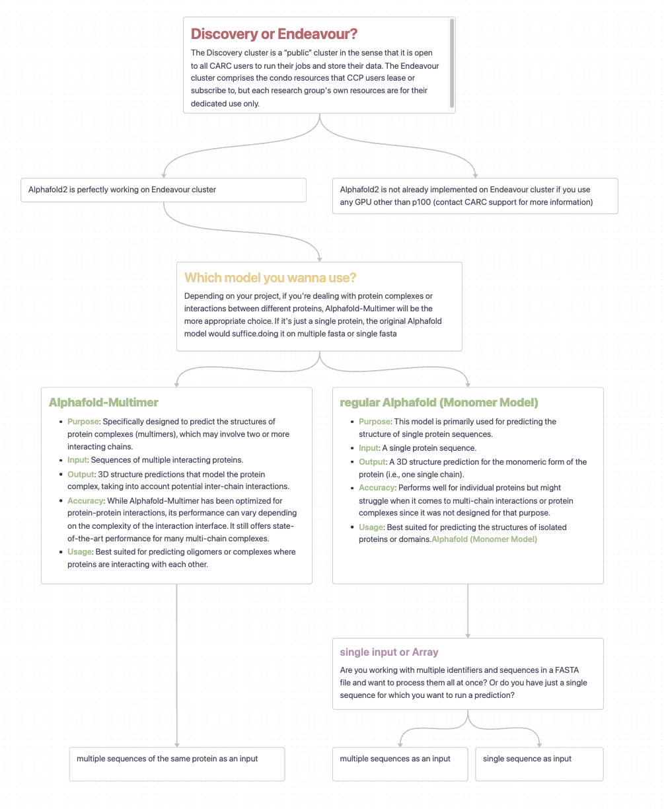
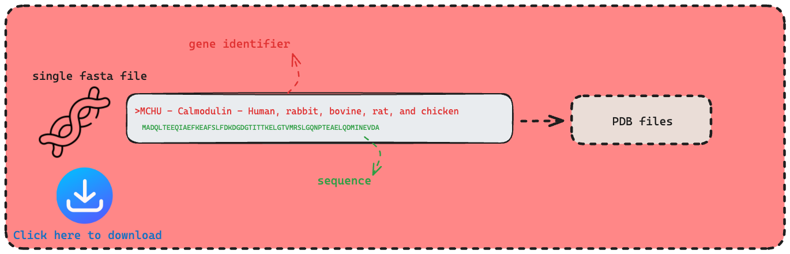
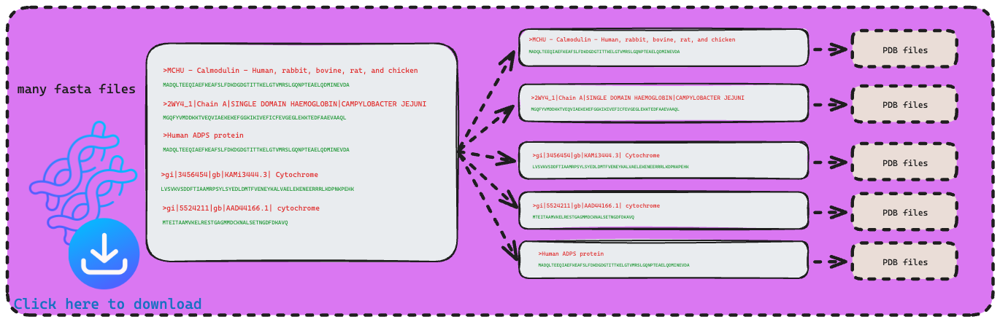
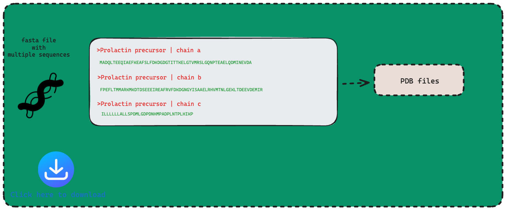

# A Practical Guide to Use Alphafold in CARC


This repository provides a comprehensive guide and scripts to help CARC (High-Performance Computing at the University of Southern California) users efficiently run Alphafold for protein structure predictions. The guide is specifically designed for USC students and all CARC users, especially those affiliated with the MEB (marine and Environmental Biology) department.

## Features
- **Optimized Code for Alphafold:** Learn how to write the best possible code for running Alphafold on CARC.
- **Batch Protein Structure Predictions:** Includes scripts for running multiple predictions using array jobs, allowing you to easily handle large-scale protein analysis.
- **Future Updates:** Scripts for managing outputs and potentially visualizing protein structures will be added.

## Installation

To use the scripts in this repository, you can either clone the repository or copy the necessary code directly into your project.

### Cloning the Repository
```bash
git clone https://github.com/KambizKalhor/my_personalized_bioinformatic_workflow.git
```

### Step-by-Step Guide to Running the Code
1. Start by using the decision chart below to choose the appropriate script for your task.
2. Update the SLURM headers to match your job requirements.
3. Execute the script.
4. Wait for the results to be generated.

#### Step one: decide which script you want to use based on chart below and download it.

#### Download one of the scripts below
[](run_alphafold_single_sequence.sh)
[](run_alphafold_multiple_sequence.sh)
[](run_alphafold_complex_multimer_proteins.sh)


#### Step Two: Update the SLURM Headers to Match Your Job Requirements

Below is an example of a SLURM script I used:

```bash
#!/bin/bash
#SBATCH --account=asteen_1130
#SBATCH --partition=gpu
#SBATCH --cpus-per-task=8
#SBATCH --nodes=1
#SBATCH --gres=gpu:p100:1
#SBATCH --mem=60GB
#SBATCH --time=02:00:00
#SBATCH --array=1-10
```

### What to Update:
1. **Project Account**: Change `--account` to your specific project account. You can find your account by visiting the [CARC User Portal](https://hpcaccount.usc.edu/) and looking for `slurm_account: your_project_account`.
2. **Resources**: Modify the following based on your job's requirements:
   - `--nodes`: Adjust the number of nodes.
   - `--cpus-per-task`: Set the number of CPUs per task.
   - `--mem`: Change the memory allocation.
   - `--time`: Set the estimated time for your computations.

3. **Job Arrays**: If your script uses the `--array` tag, adjust it to reflect the total number of sequences you're processing (e.g., `--array=1-<sequence_count>`).


### Usage
How to use:
```bash
sbatch run_alphafold_script.sh <input.fasta> <output_directory>
```
Example usage:
```bash
sbatch run_alphafold_script.sh /data/proteins/input.fasta /data/results/
```


### Customization
Feel free to modify the scripts to suit your protein prediction needs. You can adjust batch sizes, memory allocations, and other computational parameters as needed.
if you want to know more about alphafold parameters read this. [READ](more_about_parameters.md)

If you want to know more about outputs, read this.[READ](more_about_outputs.md)


### Contributions
This project is open source and welcomes contributions from the community! If you'd like to contribute:

### License
This project is open source and available under the MIT License. Feel free to use, modify, and distribute the code.

### Contact
If you have any questions or need further assistance, please reach out to me via email at kkalhor@usc.edu.

for more information please visit [google-deepmind](https://github.com/google-deepmind/alphafold)


note to myself
use "git pull origin main" to pull
use "git push origin --all" to push


